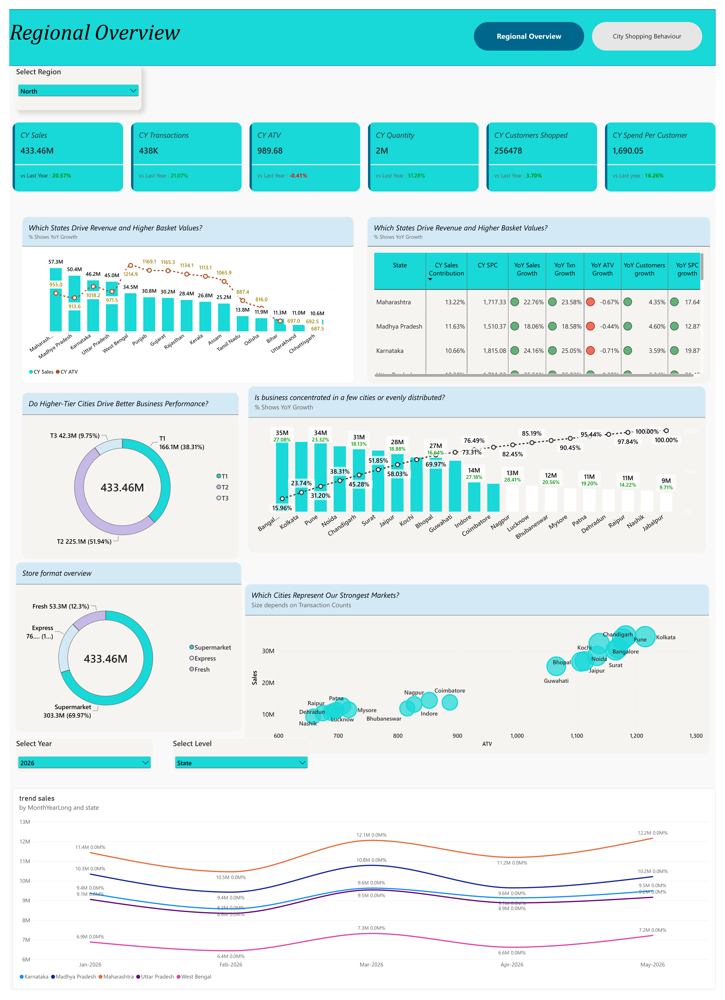

# Project 3 — Geography Deep Dive Analytics

## 📌 Project Overview

A Power BI analytics report developed to analyze retail store performance across regions, states, cities, store formats, categories, and SKUs.

The analysis used Gold-layer data prepared in Databricks.

---

## 🎯 Business Problem

The business required deeper geographical analysis to understand:

- Differences in regional performance.
- City-level customer shopping behavior.
- Performance across different store formats.
- Category and SKU-level gaps.
- Regional growth patterns.

---

## 🛠️ Key Work Performed

- Reviewed the BRD and wireframes.
- Worked with three Gold-layer tables:
  - `tbl_geo_regional_health`
  - `tbl_geo_monthly_trend`
  - `tbl_geo_city_shopping_behaviour`
- Developed a two-page Power BI dashboard.
- Created regional performance KPIs.
- Developed regional treemaps and summary tables.
- Created scatter plots for performance analysis.
- Analyzed monthly sales trends.
- Built city-level shopping behavior analysis.
- Analyzed category performance.
- Analyzed brand balance.
- Created Top 10 SKU analysis.
- Added slicers and drill-through functionality.

---

## 📊 Key Insights

- Tier 1 metropolitan cities generated the highest overall sales volume.
- Selected Tier 2 cities showed stronger year-over-year growth.
- Average Transaction Value varied across different store formats.
- Category performance differed across cities.
- The analysis identified differences in regional and city-level shopping behavior.

---

## 💡 Business Impact

The analysis supports:

- Regional inventory planning.
- Store strategy decisions.
- City-level performance analysis.
- Category and SKU planning.
- Faster identification of geographical performance differences.

---

## 🧰 Tools & Technologies

- Power BI
- Databricks SQL
- SQL
- DAX
- Data Visualization
- Business Analytics

---

## 📷 Dashboard

Dashboard screenshots are available in the `screenshots` folder.

!(Project3-2.png)
