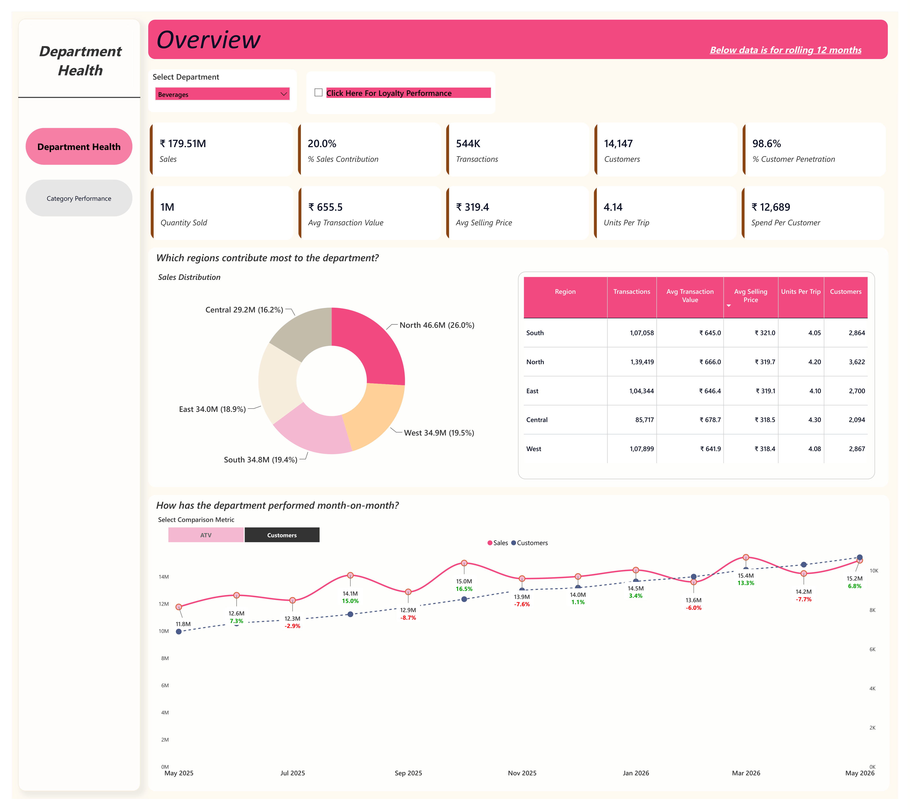
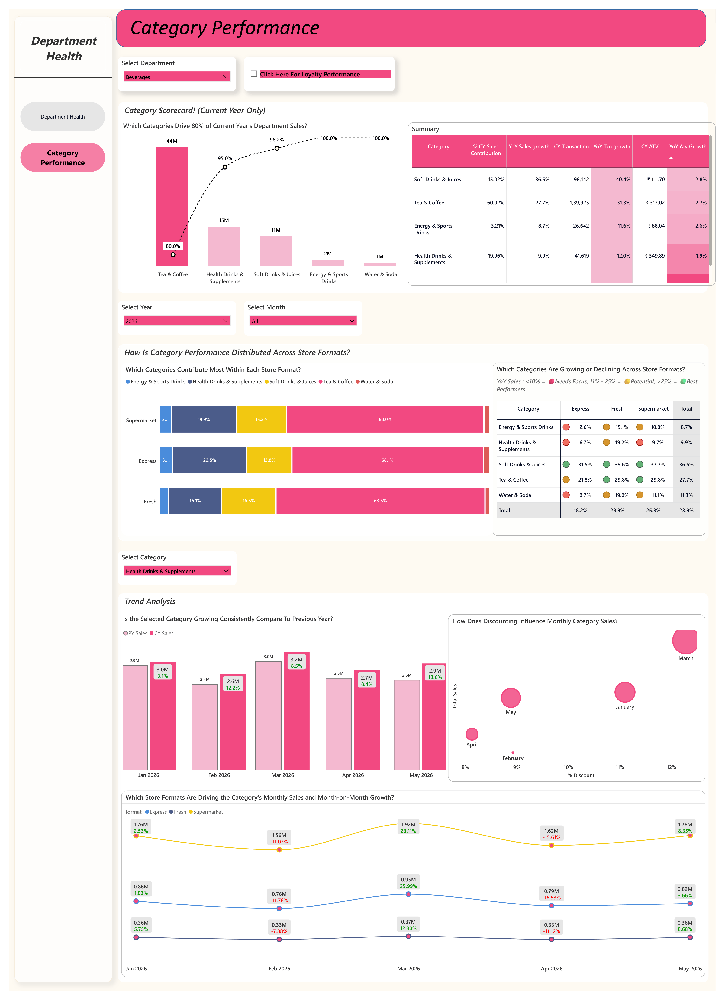

# Project 4 — Department Health & Category Performance Dashboard

## 📌 Project Overview

A Power BI dashboard developed to analyze department and category-level performance across regions, store formats, sales periods, and discount levels.

The data was cleaned and structured using Databricks.

---

## 🎯 Business Problem

The business required detailed visibility into:

- Department-level sales performance.
- Category performance.
- Regional strengths.
- Store-format performance.
- Monthly sales trends.
- Discount and sales relationships.

---

## 🛠️ Key Work Performed

- Developed a two-page Power BI dashboard:
  - Department Health
  - Category Performance
- Created KPI cards.
- Built regional donut charts.
- Created regional summary tables.
- Developed monthly sales trends.
- Performed Pareto 80/20 analysis.
- Created category scorecards.
- Built stacked bar charts and matrices.
- Compared current-year and previous-year category performance.
- Created discount-vs-sales scatter analysis.
- Analyzed monthly store-format trends.

---

## 📊 Key Insights

- The North region generated approximately **$46.6M**, representing around **26%**.
- The Central region generated approximately **$29.2M**, representing around **16.2%**.
- Tea & Coffee contributed approximately **60.02%**.
- Health Drinks contributed approximately **19.96%**.
- Soft Drinks/Juices contributed approximately **15.02%**.
- Fresh and Supermarket formats showed stronger year-over-year performance.
- Higher discounts in March were associated with higher sales compared with April.

---

## 💡 Business Impact

The dashboard provides insights that can support:

- Regional stock allocation.
- Store-format planning.
- Category management.
- Discount planning.
- Identification of high-performing departments and categories.

---

## 🧰 Tools & Technologies

- Power BI
- Databricks
- SQL
- DAX
- Data Visualization
- Business Analytics

---

## 📷 Dashboard

Dashboard screenshots are available in the `screenshots` folder.

