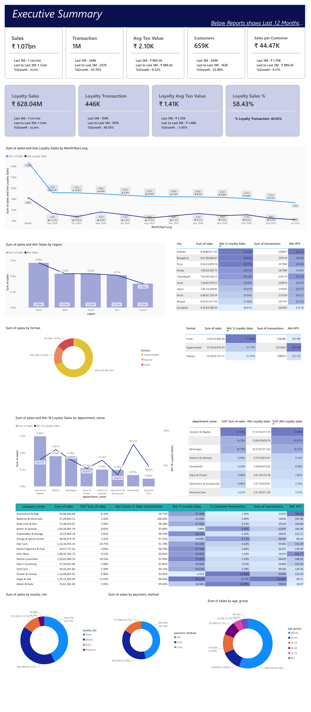
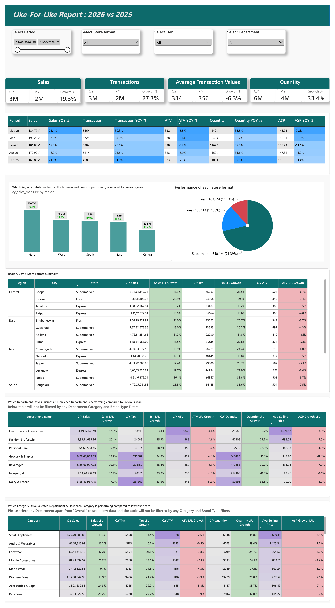
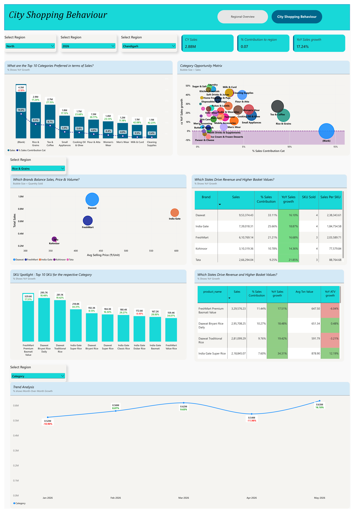

# DataMelon Labs — Industry Fellowship Projects

Seven projects completed as part of my Industry Fellowship with **DataMelon Labs**.

The projects cover retail business analytics, sales performance, geography analysis, department/category performance, customer analytics, customer engagement, and RFM-based customer segmentation.

---

## Projects

### Project 1 — Retail Executive Summary Dashboard

**Objective:**  
How can overall retail performance be monitored quickly through sales, customers, stores, and payment behavior?

**Tools:** SQL · Databricks · Power BI

[View Project 1](Project1.md)

---

### Project 2 — Like-for-Like Sales & Performance Analytics

**Objective:**  
How is business performance changing compared with the equivalent period of the previous year?

**Tools:** SQL · Databricks · Power BI

[View Project 2](Project2.md)

---

### Project 3 — Geography Deep Dive Analytics

**Objective:**  
How does retail performance vary across regions, cities, store formats, and categories?

**Tools:** SQL · Databricks · Power BI

[View Project 3](Project3.md)

---

### Project 4 — Department Health & Category Performance

**Objective:**  
Which departments and categories are performing well, and where are there opportunities for improvement?

**Tools:** SQL · Databricks · Power BI

[View Project 4](Project4.md)

---

### Project 5 — Customer Analytics & Customer Lifetime Value

**Objective:**  
How valuable is a customer over their relationship with the business?

**Focus:** Customer Analytics · CLV · Loyalty · Retention · Customer Lifecycle

[View Project 5](Project5.md)

---

### Project 6 — Customer Analytics & Engagement Strategy

**Objective:**  
How engaged are customers, and are they coming back?

**Focus:** Customer Engagement · Repeat Customers · Retention · Reactivation

[View Project 6](Project6.md)

---

### Project 7 — Customer Analytics & RFM Segmentation

**Objective:**  
Which type of customer is this based on their purchasing behavior?

**Focus:** RFM Analysis · Customer Segmentation · Customer Value · Cross-Selling

[View Project 7](Project7.md)

---

## Skills & Tools

- SQL
- Databricks
- Power BI
- Data Analysis
- Customer Analytics
- Customer Segmentation
- RFM Analysis
- Business Intelligence
- Dashboard Development
- Business Problem Analysis

---

## Project Coverage

| Area | Projects |
|---|---|
| Executive Retail Analytics | Project 1 |
| Sales Performance | Project 2 |
| Geography & Store Analytics | Project 3 |
| Department & Category Analytics | Project 4 |
| Customer Lifetime Value | Project 5 |
| Customer Engagement | Project 6 |
| RFM Customer Segmentation | Project 7 |

---

## Confidentiality Note

Some project materials are not publicly included due to confidentiality requirements.

This repository contains only permitted project summaries, documentation, and selected dashboard screenshots. No raw datasets or confidential source materials are included.

---

## Fellowship

**Industry Fellowship — DataMelon Labs**

Focus: **Data Analytics · Business Intelligence · Customer Analytics**
